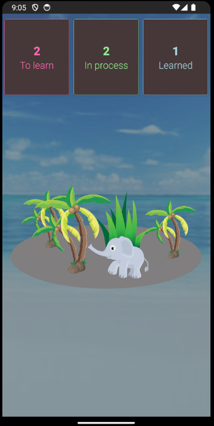
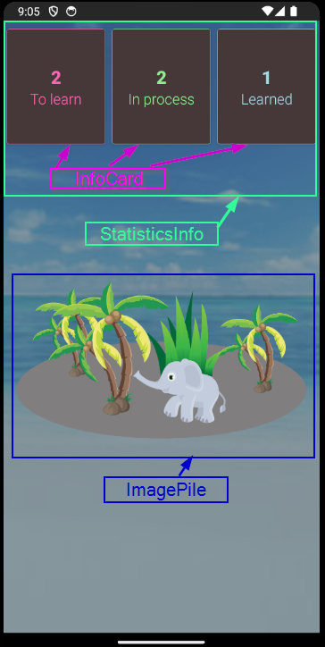

# React Native Practical Course
## Basic Components

Please, create an application that looks like this:  

You should create your own components for the implementation:
 - ### InfoCard 
   - takes color, caption, and number.
   - Displays number and caption using color. 
   - Sets border as the thinnest line of color defined in *color* prop
 - ### StatisticsInfo
   - renders 3 InfoCards with props
     1. "To learn" as a caption, "hotpink" as a color 
     1. "In process" as a caption, "lightgreen" as a color 
     1. "Learned" as a caption, "lightblue" as a color          
    Import array from *data/words* file and use it to set corresponding *number* props
 - ### ImagePile
   - renders composed image from images from assets folder: elephant.png, palmtree.png, grass.png.
   - also should render "ground" - this is not an image, think how you can do it with View and styling.
 - ### App
   - renders StatisticsInfo and ImagePile.
   - optionally, you can use an image background with this component.  
     (on the screenshot *ocean.png* is used from *assets* folder)  

