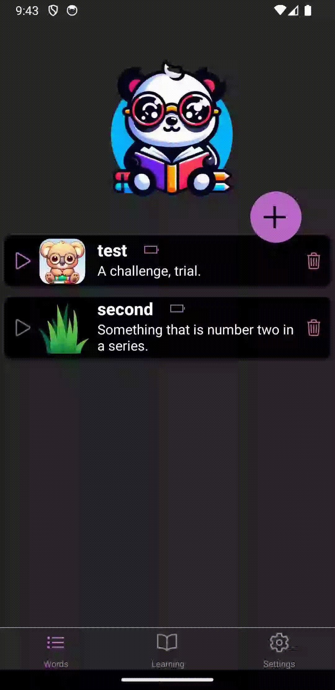

# React Native Practical Course
### Using native device features: work with image gallery with Expo Image Picker

## Application
Please, implement the ability to add images to the words, use the "expo-image-picker" package for this.
User should be asked to grant permission to use the image gallery when trying to assign an image to a word for the first time (So, the app will work correctly on both Android and IOS platforms).

### Screens:
**AddWord** screen should allow the user to add an image to a word from the gallery.  
The ability to add an image should be enabled only if the user entered an existing word (info about the word is received from the server). Also, it should be possible to change the image.  
  
**EditWord** screen should allow the user to set/update an image for an existing word.

Set the next options for the image selection: 
 - width to height ratio of picked images as 1:1, 
 - quality as 0.5 
 - allow editing, so the user will be able to select crop area

 
If no image is selected for the word, a placeholder with the text "No image taken yet." should be displayed on the AddWord and EditWord screens.
     
    
      
**AllWords** screen should show user's words with their images. If there is no image with a word, please, use assets/no-image.png.  
  

    
     
Optional task: 
   
**Play** screen - you can display images of words when the user learns his words. This task will not be verified by tests.  
  

    
    
   
*Use Redux store to store information about the words.*

