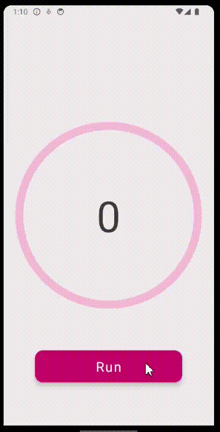

# React Native Practical Course
 **Animations with Reanimated**

## Application
- Please, implement a circle progress bar functionality that works as follows:  

## Tasks
You have some code added to the App.js. Make changes to the code only needed for the animation to work. You need to implement
1. Circle line animation   
   To do this, use 
   - **animatedProps** property of AnimatedCircle
   - **useAnimatedProps** hook
   - **strokeDasharray** property should be animated with the help of animatedProps and useAnimatedProps
1. Text animation inside of the circle  
   To implement this, use 
   - **useDerivedValue** hook that generates string based on current progress value
1. Start animation on press event on the Run button. The duration of the animation should be 2 sec.

Use one shared value for generating both animated props and derived value.  
The range of values for shared value should be [0, 1] for animation in one direction.

### **A piece of advice**
*Try to investigate how the first 2 elements of strokeDasharray array work. Use different values and see how they affect rendering the circle.*

