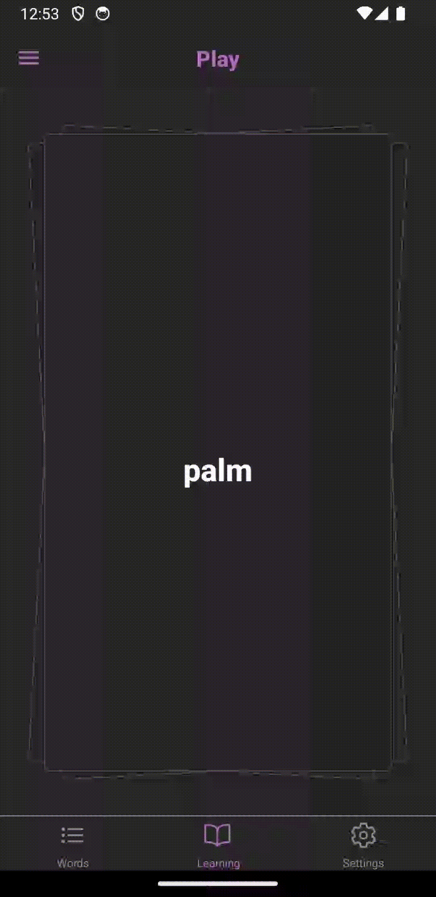

# React Native Practical Course
## React Native Gesture Handler

Please, implement the following features in the app:

1. On the Play screen on press on the card with the word, the card should rotate to show full info about the word. Until the card is rotated, movements of card should be unavailable.  

2. Tips for user should be shown depending on movement direction of the card. Opacity of the tip should depend on the translation magnitude by the X axis. 

3. If user releases the card and translation magnitude by X axis is less than screen width divided by 2.3, the card should move to its original place like shown below:  

4. Card should be shown with imitation of a deck of other word cards. When user moves the card or the card is rotated, the card with the next word should be visible underneath.
5. When a card is swiped to the left, the movement back to the deck should be shown. When card is swiped to the right, the movement outside of the screen should be shown and movement back to the deck should not be shown. 

6. Optional task. It will not affect your mark for the task.  
When user swipes the card to the right - it should be handled as if user presses *Knew it* button from previous sprints - the learning status of the word should be updated. 

## *Note*
*It is not required in this implementation to display the correct words that need to be learned. Because the main goal of this sprint is to work with animations and gesture handling.   
But if you wish to implement it - you are welcome :)*
