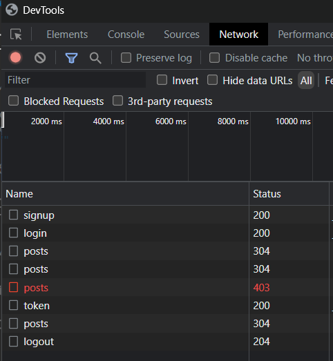

# React Native Practical Course
Authorization with JWT

## Application
Please, add the logic to the app so that it will allow user to sign up, log in, and retrieve data from the server

The server is located in the *server* folder, read *server/README.md* for details.
The list of all endpoints of the server is listed in server/requests.rest (you can use extension **REST Client** to be able to send requests from requests.rest file within VS Code to test server's responses)  
To start the server 
 - enter the server directory (cd server)
 - run npm start

One of the ways how make requests from expo app to the server on localhost: 
open a prompt and type ipconfig, check the line of your network interface, and get the address IPV4, should look like 192.168.1.20. Then you can make your calls with axios and a URL looking like htt://192.168.1.20/routname

### SignupScreen 
 - should allow to create user with specified credentials on the server 
 - and after successful user creation should log in user

### LoginScreen
 - should log in user with specified credentials

After successful logging in two JWT tokens will be returned from the server: access token and refresh token

### WelcomeScreen
 - should be displayed if app received JWT token
 - posts should be displayed on the screen. Posts should be received from the server by a get request with the authorization header that contains JWT access token
 - on pull down the list with posts a new get request for posts should be made to the server. 
   If JWT token has expired, request to get a new one should be made (with refresh token in the request's body). And new get request for posts with a new JWT token should be made.
 - on clicking on "logout" icon the request for logout should be made to the server

### Application state
Redux toolkit should be used (in *store* folder) to manage application's authentication data.
Create authSlice for this. Required properties of the state in authSlice:
*login, token, refreshToken*.  
Initial values should be null for them.  
After user logs in, these fields should contain corresponding values.  
After user logs out, they should be null again.  
You are allowed to use other fields too, if you need them.  

*Display of work and sent requests*

