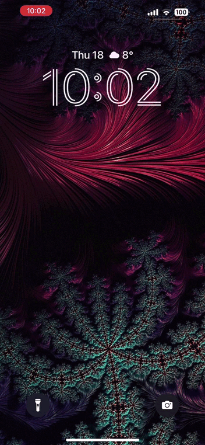

# React Native Practical Course
Working with Notifications in React Native

### Application description
It's an application that allows you to create countdown timers and reminders for important events and dates in your life. 
Users can specify the title and date of the event, and the countdown will start by pressing the button. Users also have the ability to remove events and see how many days are left until each event.

### Application Demo

## Task
1. Configure local notifications for the project and install the necessary libraries.
2. Implement scheduling a local notification when a new event is created.
3. Dismiss the scheduled notification when an event is deleted.
4. \*Give users the opportunity to choose an event emoji.
5. \*Add a notification action (category) that allows users to delete the event without opening the app.

\* - optional feature

### Result Demo

