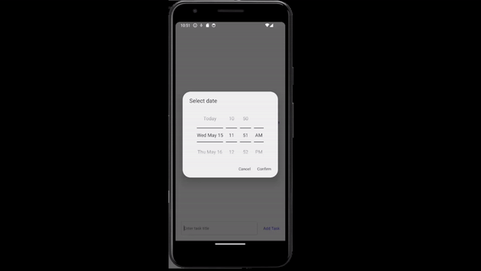
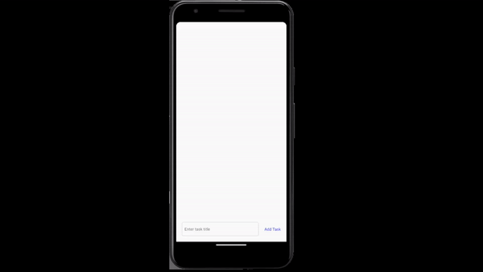

# Practical Task

## Description
A simple **to-do** application. Each task should have `due date`, which the user specifies via calendar.

## Multiplatform

First we added `DateTimePicker` from `"@react-native-community/datetimepicker"` for display this calendar.
Our solution must work both *Android* and *iOS* systems with the visual below

but corresponding mode `"datetime"` available only for *iOS* platform [modes](https://github.com/react-native-datetimepicker/datetimepicker?tab=readme-ov-file#mode-optional).

So, your task is to replace `react-native-community/datetimepicker` with `"react-native-date-picker"`.

`react-native-date-picker` [can't be used in the "Expo Go"](https://github.com/henninghall/react-native-date-picker?tab=readme-ov-file#expo) app because it requires custom native code. Therefore, you need to use native Android folder using `npx expo prebuild`, then you can run application `npx expo run:android` (or `npx expo run:ios`).

## Requirements
For passing tests complete all requirments:

1. `App.jsx` should render a text input with the placeholder `Enter task title`.
2. `App.jsx` should render pressable element with the text `Add Task`.
3. If user input a task title and press the **Add Task**, the task should be added to the screen. Each  task can be deleted and edited by pressing **Edit** and **Delete**.
4. By default text `No Due Date` should displayed on the task block.
5. If user click on `No Due Date` a `DatePicker` with a `modal` view and `datetime` mode should be displayed.

## Build locally
If you have installed JAVA and it was added to PATH (`JAVA_HOME` variable) you can build apk file for application by running ` ./gradlew assembleRelease` from android directory.

## Build on GitHub
If all tests passed github workflow also give you apk file:

1. Go to the Actions tab.
2. Choose the Summary.
3. Scroll to the bottom to see the Artifacts of the action.
4. You can use the [workflow file](/.github/workflows/test-and-build.yml) for building your *React Native* application with GitHub Actions. Good luck!

## Demonstration

