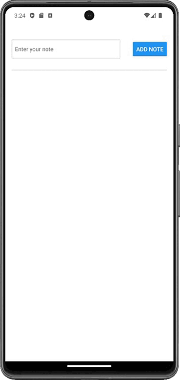

# React Native Practical Course

## SPRINT 2. Handling events. State

Implement a notepad mobile application that works as shown below:

### Requirements

Follow the application structure defined in the App.js component. The changes you will need to make will mainly be related to working with state and events.

In the input text field, the user enters the text of the note, after clicking the "Add note" button, the note is displayed as a new item in the list of notes. The text field for entering a note is cleared after clicking the "Add note" button.

It is necessary to ensure that it is impossible to add an empty note.

The data entered in the input text field is stored in the state.

**Pressable component**

When a Pressable component is clicked and held, its background color should change from BACKGROUND_COLOR to PRESSED_BACKGROUND_COLOR

Also, when a note is pressed, the color of the note text should change from NOTE_COLOR to PRESSED_NOTE_COLOR.

It is necessary to ensure the processing of a long press on a note lasting 1 second, as a result of which the message "The note is pressed with a delay of 1 sec!" should appear on the screen.

**ADVICE**
Think about how to store and work with the current list of added notes.
