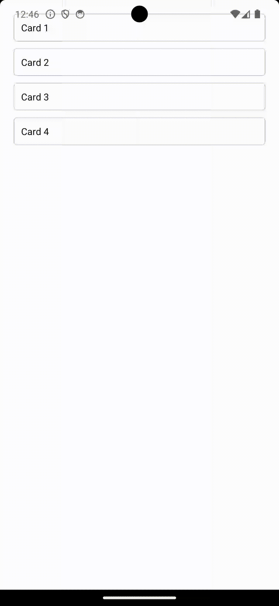

Practical Task

1. Use App.js file to render the array of cards showing their titles
2. All data is stored inside of the state
3. When clicking the card open the modal window with card title and description
4. Add the close button to the modal (with the text "Close") to close the window
5. Check your solution using npm test
6. Push your solution to the repository

#Example of ready Task functionality

