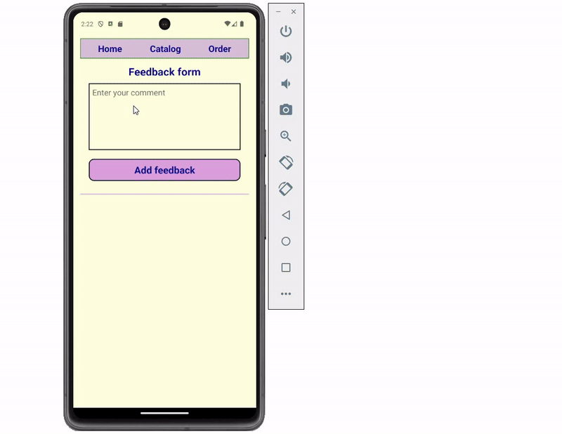

# React Native Practical Course

## SPRINT 5. Creating Adaptive UI

For a given mobile application, implement its adaptability and correct, dynamic operation in portrait and landscape modes. Pixel perfect implementation accuracy is not required from you, but be attentive to details, try to implement the structure and operation of the application, as shown below:

### Basic requirements for running the application in landscape mode

In Landscape mode, the application must place the navigation menu on the left side of the screen; menu items must be placed vertically and aligned to the left side of the navigation block. Also, a corresponding image should appear in the center at the bottom of the navigation block.

In landscape mode of the application, the "Feedback form" header should be placed at the top of the screen.

In landscape mode of the application, the "Add feedback" button should be placed at the same level on the right side of the feedback input field.

In landscape mode of the application, the width of the published response increases.

It is necessary to ensure that all feedback is displayed correctly in landscape mode - if several feedback have been added, when scrolling down, the last feedback should be displayed correctly.

In landscape mode, you must ensure that the keyboard is working correctly to add a new feedback.

**Platform specific code**

Using the capabilities of the Platform API, it is necessary to provide the background color ANDROID_BACKGROUND_COLOR for an application running on the Android platform, and the background color IOS_BACKGROUND_COLOR for an application running on the IOS platform.

Also, taking into account the specifics of your platform (Android or iOS), implement, as shown in the demo-example, shadows for published reviews.

**Video**

The final result of the task should be a short video that you record and upload for verification, which demonstrates the correct operation of the application in portrait and landscape modes.

The structure of your demo video should follow the example given in the assignment. Namely, you should first show inputting feedback in portrait mode, then demonstrate switching to landscape mode and inputting feedback in it. Next, you need to return to portrait mode, enter the 3rd review and once again switch to landscape mode and show that you have the last review correctly displayed/scrolled.

As input data, you can, for example, enter first your first and last name, then your group, etc.