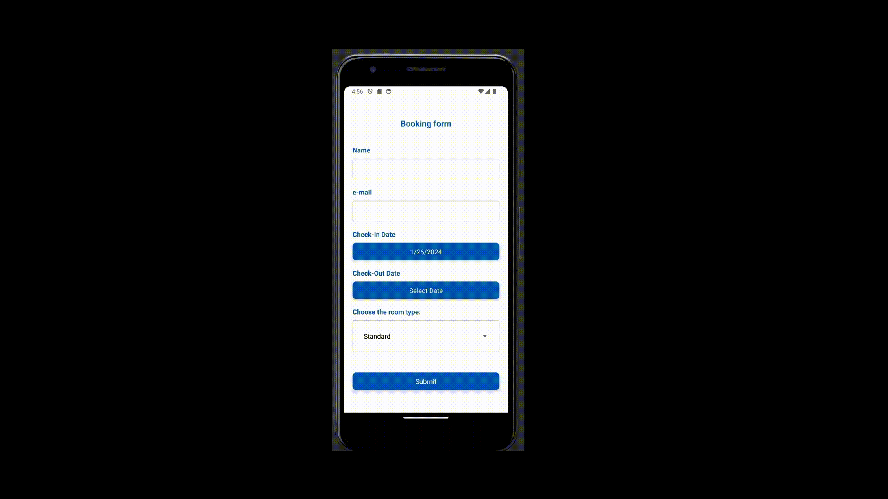

# React Native Practical Course

Handling user input, work with forms, Form validation (react hook form, Picker, DateTimePicker)

# Application

It is application for booking hotel room. User should input his name, email, choose check-in date and check-in date and choose room type. Available room types: **Standard**, **Luxury**, **Family**.

# Example

# Tasks

1. Change the `TextInput`s for dates on `DateTimePicker` from `@react-native-community/datetimepicker`
2. Add next `testId` atribute values:

- DateTimePicker - `"date-time-picker"`,
- TextInput for username input - `"user-name-input"`
- TextInput for email input - `"email-input"`

3. Apply validation for elements in [App.js](App.js), use `react-hook-form` library for it.

4. Button **Submit** must validate all userinputs using `react-hook-form` library, all field are required. Show corresponding message(s) `"Name is required"`, `"e-mail is required"`, `"Check-Out Date is required"` if field(s) is(are) empty after click on the button **Submit**.
   
5. Add validation rules for user inputs:

- name - name must start with a capital letter and contain at least 3 characters, if not, display error-text `"Name must start with a capital letter and contain at least 3 characters"`
- for email validation use pattern `/^[a-zA-Z0-9._%+-]+@[a-zA-Z0-9.-]+\.[a-zA-Z]{2,}$/`, if email is not valid display error-text `"Invalid email address. Please enter a valid email"`
- The Check-Out Date must be later than the Check-In Date, if not show error-text `"The Check-Out Date must be later than the Check-In Date"`.
  

6. By default **Check-In Date** is set as today date. For all dates use method `.toLocaleDateString()` for showing on page.
7. **Standard** room type is chosen by default.
8. Date validation must be running after setting any date or press the button.
   
9. Only if all fields are filled correctly, the function `sendData` from [services](services/sendDate.js) should be called with argument `{userName, email, roomType, checkInDate, checkOutDate}` when the **Submit** button is pressed.
   
