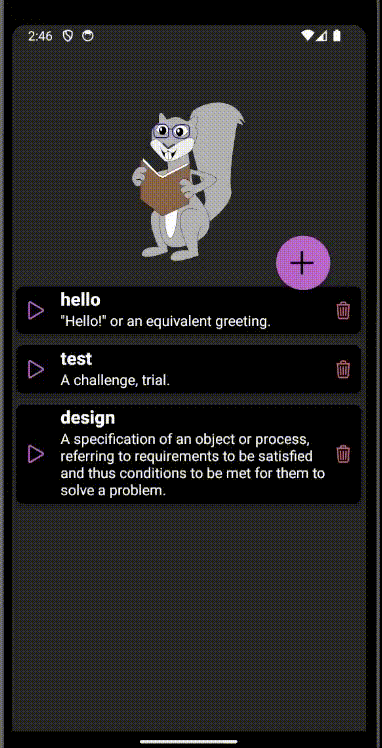
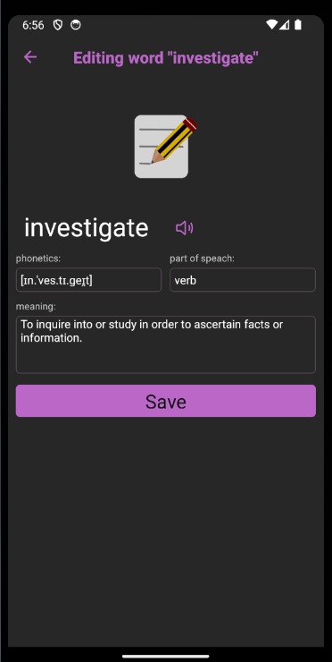

# React Native Practical Course
React Navigation. Native Stack

## Application
- Please, use Native Stack from React Navigation in the dictionary app:  

## Tasks
### Navigation
Navigation should be used for switching between AllWords, AddWord, and  EditWord screens
 - AllWords is a starter screen
 - on press on "+" button AddWord screen opens
   - standard back button should be present on AddWord screen which returns the user to AllWords screen.
   - *Add* button should return to AllWords screen and pass the word information through the route parameter
   - the title of the screen should be "Adding word" at first, and then if the user types a word and information is found, the title should change to *Adding word [word]*. If information about the word is not found, the title should be "Adding word". This behavior should be handled in the EditWord component
 - on press on any word EditWord screen opens 
   - standard back button should be present on AddWord screen which returns the user to AllWords screen.
   - *Save* button should return to AllWords screen and pass the word information through the route parameter
   - the title of the screen should be *Editing word [word]* 
  
### EditWord component

       
 - you should implement logic of editing word here - the component should allow the user to edit phonetics, part of speech, and meaning of the word
 - the component should receive and use only standard navigational props - *route* and *navigation*
 - should have *Save* button that returns the user to AllWords screen and passes word information through the route parameter

### AddWord component    
 - receives and uses only standard navigational props - *route* and *navigation* 
 - should have *Add* button that returns to AllWords screen and passes new word information through the route parameter

 ### AllWords component    
 - should be able to handle route parameters with added or edited word information to correcly display all user's words.

#### *Note: [word] - is the current word that is being added/edited*