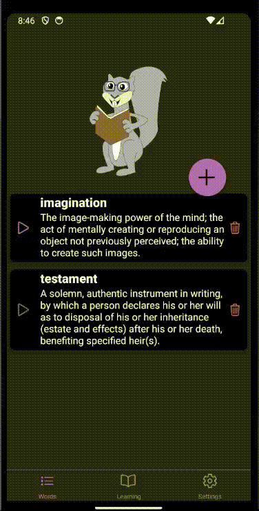
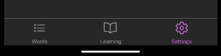
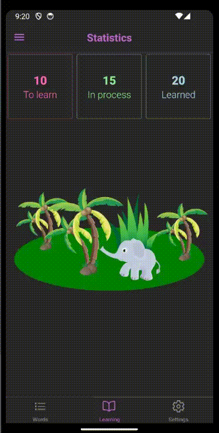
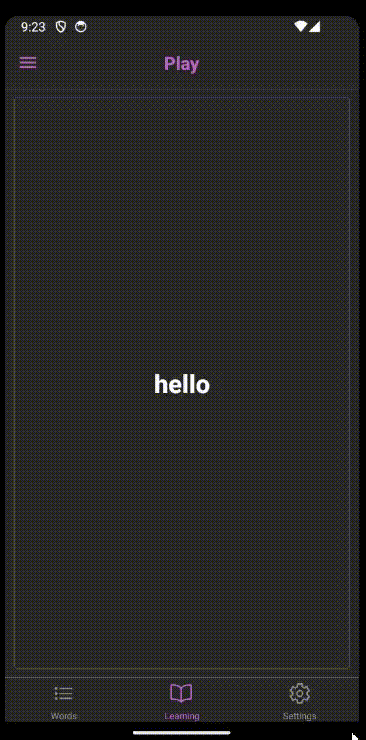
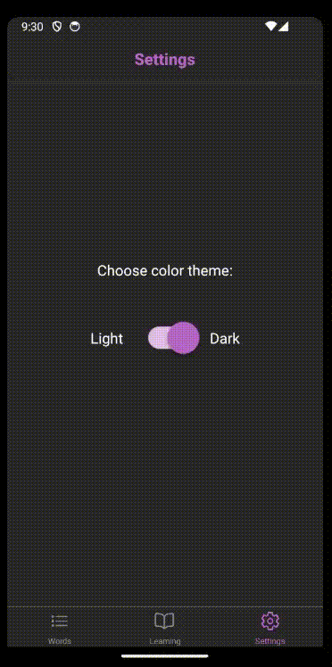
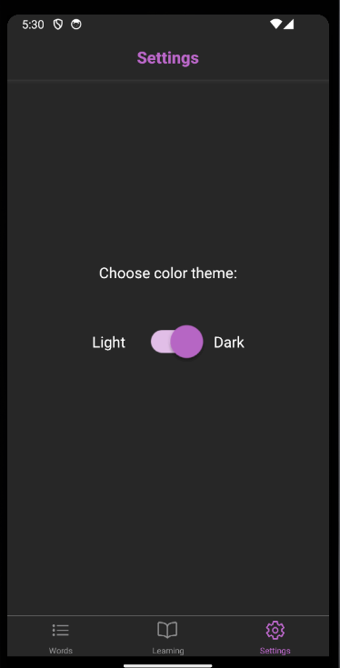
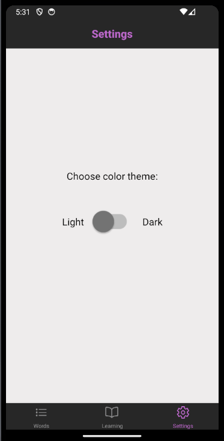

# React Native Practical Course
React Navigation. Bottom Tabs, Drawer. Nested Navigation

## Application
- Please, use Bottom Tabs, Drawer from React Navigation in the dictionary app:  

## Tasks
Create Bottom Tab navigation with 3 tabs: Words, Learning, and Settings as shown in the picture:  
  

  
Use names of screens the same as names of corresponding tabs  
Use component WordsNavigation for Words tab  
Use component LearningNavigation for the Navigation tab  
Use screen component Settings for the Settings tab  
  
WordsNavigation and LearningNavigation should implement child navigations, see the description below.  

Ionicons *icons list-outline book-outline settings-outline* icons should be used for bottom tabs correspondingly. Use size and color props for the icons.

Color of the active tab icon and caption should be COLORS.primary900 (from constants.js)
Color of the active and inactive tab background should be COLORS.appBackground
Color of the Headers background should be COLORS.appBackground
Color of the Header should be COLORS.primary900
The header should be aligned by the center
Apply the color and alignment settings listed above in one place for all the tabs
    
### Words tab
Work with words should be used as nested navigation within drawer navigation. It should behave the same way as it did in the task of the previous sprint:
Stack Navigation is used for switching between AllWords, AddWord, and  EditWord screens
 - AllWords is a starter screen
 - on press on "+" button *AddWord* screen opens   
 - *Add* button returns to *AllWords* screen
 - on press on any word *EditWord* screen opens
 - *Save* button returns to *AllWords* screen
  
Only the titles from Stack Navigation should be displayed.  
This is working functionality, you just need to place it within the first tab of the Bottom Tab Navigation

### Learning tab
You should place Drawer Navigation into the Learning tab.
The Drawer should consist of 2 items: Statistics and Play.  
  
Only the titles from the Drawer Navigation should be displayed (not from the Bottom Tab navigation).
Background inside of the Drawer Navigator should be COLORS.appBackground, the same with the background color of the header
Color of text of selected menu item should be COLORS.primary100
Color of text of not selected menu items should be COLORS.fontMain
Background color of selected menu item should be COLORS.primary300
Background color of drawer should be COLORS.primary200
  
Show Statistics screen (it is implemented already) when Statistics item is selected
Show Play screen (you will need to implement it) when Play item is selected

### Settings tab
Should display Settings screen (you will need to implement it).

### Play screen
  
    
Create component Play that takes *words* prop.
The idea behind this prop is the all words that user gathered. But in this sprint's task, you do not need to pass the correct value, you can use dummy data.
For now - if the *words* prop is undefined, get the words array from the dummyData.js 
The component should allow user to go through all words that have *status* property less than 2.
Status means the learing status of the word:
 - 0 - user hasn't learned the word at all
 - 1 - user is in the process of remembering the word
 - 2 - user has learned the word  
  
  
For each word:
 - at first, only the card with the word is shown
 - then, on press on the card, phonetics info and meaning should be shown, along with еру ability to play sound. Also, 2 buttons should appear below the card:
  - *Didn't know it* - switches user to the next word
  - *Knew it* - updates the status of the word - increases it by 1  

If there is nothing to learn (there are no words with status less than 2), then  
*Congrats!*  
*For now you have learned all the words*  
should be printed on the screen

### Settings screen
  

Should allow user to choose the color scheme.  
For this task the color scheme should be be applied to the current screen only.  
The screen should look like on the pictures:  

  
