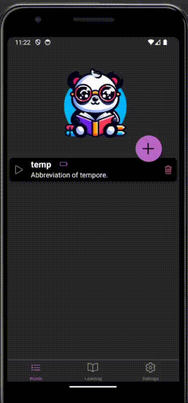

# React Native Practical Course
Redux Toolkit

## Application
Please, set up and use Redux Toolkit in the dictionary app.
The app has all the needed components  
Use the store folder and JS files within it to define state slices:
**themeSlice.js** should be used for changing the color theme throughout the whole app  
**wordLearningSlice.js** should be used for managing information regarding words and their learning statuses.  
**index.js** should set up the Redux store  

## Description
### slices:
**themeSlice** - the state structure of the slice is defined in the file.
The slice should have *toggle* reducer which changes   
 - the *isDark* field to the opposite boolean value 
 - the *color* field corresponding to the isDark field - if isDark is true, color should be assigned the value COLORS_DARK from constants file, otherwise - COLORS_LIGHT.

 The value change of the state of this slice should be triggered on the Settings screen by the switch. Apply a selected color theme to the Settings and AllWords screens. (Those two screens will be verified by tests. You can apply the selected theme to the whole app if you wish.)

**wordLearningSlice** - state of this slice contains an array of words.  
Each word in the state has the fields related to the word itself:
*word, phonetics, audio, meaning, partOfSpeech*  
You can see examples of those fields in the tests/testData.js file.  
And also, a word contains the fields, related to the learning process of the word:  
*dateForgets, dateTotallyForgets, forgettingSpan, status.*  
The idea is that when the word is added, app presumes that the user does not know it.   
Then, as the user plays with the word and presses the 'Knew it' button, the app presumes that for now user remembers the word, but he will forget it with time.  
*dateForgets* defines the point in time when the word will be partly forgotten
*dateTotallyForgets* defines the point in time when the word will be totally forgotten  
*status* value:
 - is equal to 0 if user does not know the word (dateTotallyForgets has passed)
 - is equal to 1 if user partly knows the word (dateForgets has passed, but dateTotallyForgets has not)
 - is equal to 2 if user knows the word (dateForgets has not passed)  
   
*forgettingSpan* defines the timespan (in milliseconds) after which the word will be partly forgotten.  
*dateForgets, dateTotallyForgets* values are stored in the form of a number of milliseconds for a specific date since midnight at the beginning of January 1, 1970, UTC. (use [getTime](https://developer.mozilla.org/en-US/docs/Web/JavaScript/Reference/Global_Objects/Date/getTime) function for this)

### reducers:
- **addWord**: is triggered by adding word on AddWord screen  
action payload of this reducer is an object, containing fields *word, phonetics, audio, meaning, partOfSpeech*. Word with these fields, along with fields *dateForgets, dateTotallyForgets, forgettingSpan, status*  should be added to words array if there is no word with the same value of word field in the words array:
  - status of newly added field should be set to 0
  - forgettingSpan should be set to INITIAL_FORGETTING_SPAN from constants.js
  - dateForgets for the new word should be in INITIAL_FORGETTING_SPAN milliseconds the past.
  - dateTotallyForgets for the new word should be current date and time.
- **updateWord**: is triggered by saving edited word on EditWord screen  
action payload of this reducer is an object, containing fields *word, phonetics, audio, meaning, partOfSpeech*.  
If there is a word with word field that equals to word field of payload, the info from payload should replace corresponding info of the word in state.
- **removeWord**: is triggered on AllWords screen by clicking on 'delete' icon of a word  
action payload of this reducer is a string, containing word that has to be deleted
If there is a word with word field that equals a payload, the word should be removed from words array.
- **updateWordLearnInfo**: is triggered on Play screen when user presses 'Knew it' button  
action payload of this reducer is a string, containing word whose learning info fields have to be updated:
  - dateForgets should be set forgettingSpan milliseconds in the future from now
  - dateTotallyForgets should be set forgettingSpan * 2 milliseconds in the future from now
  - forgettingSpan should become 2 times longer
  - status should be set to 2
- **updateStatuses**: should be triggered on a time interval equal to REFRESH_STATUSES_SPAN from constants.js  
payload is not needed here. This reducer checks all the words and updates their statuses according to the current date and time.
  - status should be set to 0 if current date and time is greater than dateTotallyForgets field of the word
  - status should be set to 1 if dateForgets has passed, but dateTotallyForgets has not
  - status should be 2 if dateForgets has not passed
  
### screens:
**AllWords** should display a list of all words from the state. Ionicons icon should display status of each word:  
0 - battery-dead-sharp  
1 - battery-half-sharp  
2 - battery-full-sharp  
**Statistics** should display info about quantity of words to learn (status 0), In process (status 1), and Learned (status 2)  
**Play** should use words with statuses less than 2 from the store and dispatch *updateWordLearnInfo* action on press on the "Knew it" button.  
**Settings** should allow user to choose theme and  dispatch *toggle* action on press on the "Knew it" button. 

